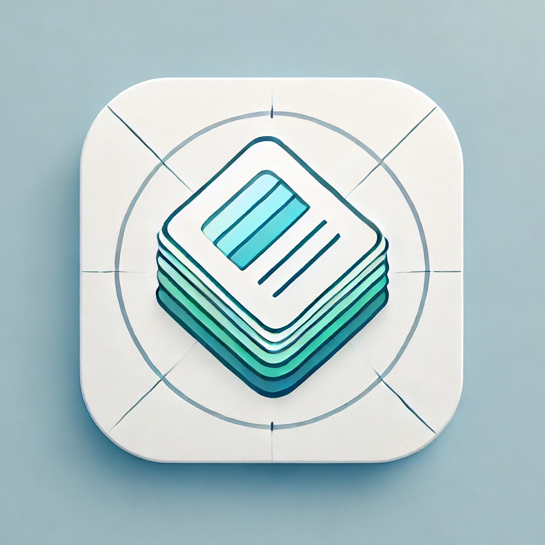

***Language Decks***




---

**Project Description:**

Language Decks is an educational Android application designed to help users improve their vocabulary and language learning skills through interactive flashcards. The app allows users to create, edit, and manage decks of flashcards, track their learning progress, and utilize images for better word associations. Each card in a deck contains words and their meanings, and users can toggle between “learned” and “unlearned” cards. The app offers smooth UI transitions and an organized deck system for efficient learning.

**Features:**

- **Create & Edit Decks:** Users can create new decks, name them, and add cards with words and their meanings.
- **Card Management:** Add, edit, or delete cards with ease. Each card can include an image, word, and its meaning(s).
- **Image Support:** Cards can be enhanced with images to aid memorization.
- **Learned/Unlearned State:** Users can mark cards as learned or unlearned to keep track of progress.
- **Swipe-to-Refresh:** Shuffle the unlearned cards with a simple swipe action.
- **Data Persistence:** All decks and cards are saved locally using SharedPreferences, ensuring data is retained across sessions.
- **Edge-to-Edge Support:** The app is optimized to utilize the full screen on modern devices.

---

**Project Structure:**

- **MainActivity:** The main entry point of the app where users can view all available decks and create new ones.
- **DeckActivity:** Displays the individual cards within a selected deck.
- **UnlearnedFragment:** Shows the list of unlearned cards within a deck and allows the user to interact with them.
- **SharedPreferencesManager:** Handles data persistence for saving and retrieving decks, cards, and their states from the local storage.
- **CardAdapter:** Manages the display of cards in RecyclerView for smooth scrolling and interaction.
- **Assign Images to Cards:** Images are automatically assigned to cards when an example deck is loaded for the first time.
- **Card State Management:** Cards can be marked as "learned" or "unlearned," and the app remembers the card state across sessions.

---

**Technologies Used:**

- **Kotlin:** The main programming language used for Android app development.
- **Android SDK:** Core Android components including Activities, Fragments, and RecyclerView for a modern, modular app structure.
- **ViewBinding:** For easier and safer interaction with UI components.
- **SharedPreferences:** Used for data persistence to save and retrieve deck and card data locally.
- **Gson:** For JSON parsing when loading the sample deck from an external JSON file.
- **Android Jetpack Components:** Modern architecture components, such as Fragment Navigation and edge-to-edge support.
- **Image Management:** Images are encoded in Base64 format and stored within the app, enabling cards to display images seamlessly.

---

**How to Use:**

1. **Creating a Deck:**
    - Open the app and tap the “+” icon to create a new deck.
    - Enter the deck name and start adding cards by providing the word, its meaning(s), and optionally, an image.

2. **Managing Cards:**
    - Tap on a card to view its details.
    - Long press on a card to either edit or delete it.
    - Use the “Learned/Unlearned” toggle to track which words have been mastered.

3. **Shuffling Cards:**
    - Swipe down on the list of unlearned cards to shuffle them, creating a randomized learning experience.

4. **Assigning Images:**
    - Images are automatically assigned to cards when the sample deck is loaded for the first time.
    - You can manually edit card images by selecting an image from your device.

---

**Installation:**

1. Clone the repository:

   ```bash
   git clone https://github.com/thwisse/LanguageDecks.git
   ```

2. Open the project in Android Studio.
3. Sync Gradle to ensure all dependencies are installed.
4. Run the app on an emulator or a physical device.

---

**Usage Notes:**

- The app is designed to run on Android 7.0 (API level 24) and higher.
- For development, Android Studio Flamingo (or a later version) is recommended.
- Ensure that all necessary permissions (such as file access for image selection) are enabled on the device.

---

**Future Improvements:**

- **Cloud Sync:** Future versions may include cloud storage for decks and cards, enabling users to sync data across devices.
- **Multilingual Support:** Expanding support for different languages and localized app content.
- **Advanced Learning Metrics:** Adding insights into user progress, such as how many words are learned and reviewing cards over time.
- **Dark Mode:** Implementation of dark mode for enhanced usability during nighttime learning.

---

**Contributing:**

We welcome contributions to improve Language Decks! To contribute:

1. Fork the repository.
2. Create a new branch for your feature or bugfix:
   ```bash
   git checkout -b feature-name
   ```
3. Commit your changes:
   ```bash
   git commit -m "Add a new feature"
   ```
4. Push to the branch:
   ```bash
   git push origin feature-name
   ```
5. Open a Pull Request to the main repository.

---

**License:**

This project is licensed under the Apache License 2.0 - see the LICENSE file for details.

---

**Contact:**

For any questions or feedback, please reach out to the project maintainer at thwisse@tutanota.com.
